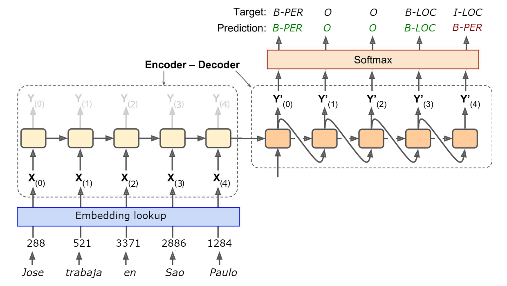

# Domain Background

For many decades the algorithms used for Natural Language Processing, on tasks like machine translation and language understanding, were based on complex rules created manually; but today the state of the art was achieved with the use of Deep Neural Networks in many domains [@young2018recent]. This change was driven by the increased availability of computing resources, but most importantly by the emergence of large annotated corpus of text, like OntoNotes [@weischedel2013ontonotes]. Because training this kind of algorithms is a costly process, researchers are looking for ways to train them with small amounts of data. 

I'm currently working on my Master's thesis and the topic is about using Active Learning to annotate a corpora on a specific domain (legal documents in Spanish). So, my main motivation is to reduce the cost of annotation by the human experts, and be able to get high accuracy on those popular NLP algorithms.


# Problem Statement

Neural Networks can achieve better accuracy for NLP tasks compared to traditional rule-based algorithms, or even other types of ML models. Yet, a major problem is that you need a lot of data to train them; as a general rule the more data you have the better. Creating an annotated corpus for NLP requires trained people, so this can become an expensive process. 

One potential solution to this problem is make the algorithm learn from a small dataset by changing its internal architecture, or by changing the way it is trained.

In this project the focus will be on the NER (named entity recognition) task, which is a classification problem. The catch is that we can not tag the words in a text independently, because they are a sequence with short an long dependencies. For example, in the phrase _"Jose trabaja para CNN en Sao Paulo, Brasil."_ we have "Sao Paulo", a two word token (or _bigram_) that means a city name; but "Paulo", as a _unigram_, could be interpreted as a person's name.


# Datasets and Inputs

Due to licence restrictions on the OntoNotes 5 dataset [@weischedel2013ontonotes], the CoNLL-2002 Ner dataset [@conll2002] will be used instead. This dataset is available for download at: https://www.kaggle.com/nltkdata/conll-corpora/version/1#conll2002.zip

The data contains two languages: Spanish and Dutch, and has three files per language: one for training and two for testing. Each file consists of two columns separated by a single space. Each word has been put on a separate line and there is an empty line after each sentence. The first item on each line is a word and the second the named entity tag. The tags uses de BIO2 syntax: a _B_ denotes the first item of a phrase and an _I_ any non-initial word. There are four types of phrases: person names (PER), organizations (ORG), locations (LOC) and miscellaneous names (MISC).

| file       | words   | phrases |
| ---------- | ------- | ------- |
| ned.testa  | 40656   | 2895    |
| ned.testb  | 74189   | 5195    |
| ned.train  | 218737  | 15806   |
| spa.testa  | 54838   | 1915    |
| spa.testb  | 53050   | 1517    |
| spa.train  | 273038  | 8323    |

And the class distribution is as follows:

| file       | ORG   | LOC   | PER   | MISC  |
| ---------- | ----- | ----- | ----- | ----- |
| ned.train  | 2082  | 3208  | 4716  | 3336  |
| spa.train  | 7390  | 4913  | 4321  | 2173  |


As for the inputs, the algorithm will be given batches of sentences, with the text tokenized, which means that the text will be separated into words. For example the phrase _"Jose trabaja para CNN en Sao Paulo, Brasil."_ will be tokenized and converted to a list:

```
['Jose', 'trabaja', 'para', 'CNN', 'en', 'Sao', 'Paulo', ',', 'Brasil', '.']
 
```

For this input the algorithm should predict the labels for each of the tokens, and output a list of same size:

```
['B-PER', 'O', 'O', 'B-ORG', 'O', 'B-LOC', 'I-LOC', 'O', 'B-LOC', 'O']
 
```


# Solution Statement

Using an Active Learning approach for training can reduce the costs of annotation, because the algorithm could get the same high accuracy with as little as the 25% of the training data [@shen2017deep], a fraction of the dataset used for training based on random sampling.

Active Learning is a semi-supervised learning algorithm, in which the model is given a pool of unlabeled data from where to pick examples, it gives a prediction and ask for feedback to a human annotator. This is also called online learning, or model in-the-loop. On each iteration the algorithm calculates the loss, between its predictions and the feedback, and chooses only the less confident prediction to ask for feedback again. This process is likely to converge faster than choosing at random an annotated example from the pool. And, because the model ask for specific examples, there is no need to annotate all the pool by humans.


# Benchmark Model

The algorithm to be implemented will not be design to get state of the art performance on this corpus (F1 score 86.86). But, as the architecture chosen is based on the CNN-CNN-LSTM algorithm from [@shen2017deep], the results in terms of accuracy should be similar of those reported in that paper (F1 score 75.63).

The benchmark will be focus on the use of Active Learning during training. With the same amount of training data, the model should get at least the same accuracy than trained with random sampling. 


# Evaluation Metrics

Mainly, the F1 score (harmonic mean of precision and recall) will be used to measure the accuracy of the trained model. The formula is:

$$F_\beta = (1 + \beta^2) \cdot \frac{\mathrm{precision} \cdot \mathrm{recall}}{(\beta^2 \cdot \mathrm{precision}) + \mathrm{recall}}$$

By training the model with variable amount of examples (10, 25, 50, 75, and 100 percent of the training data respectively) a learning curve graph, like the one in Figure 1, will be created. Here we can see when the model converges, and compare the resulting scores for each experiment.

{ width=60% }


# Project Design

The main goal of this project is implement a Neural Network algorithm for NER, train it first with _Random Sampling_ and then with _Active Learning_, and compare the amount of examples needed to get similar F1 score on a testing set. The Figure 2 depicts the model architecture, as an encoder-decoder model which uses _word embeddings_.

{ width=99% }

First, the sentences will be tokenized and used to calculate the vocabulary for word embeddings. The spanish dataset has a vocabulary size of 31000 words, so to reduce it a preprocessing of this data will be done (i.e. this will normalize common words, and change number occurrences by "\<num\>"). The word embedding layer will be trained along side the model to simplify the implementation.

For the encoder layer a CNN will be implemented, because this can reduce the computation complexity and training time. And the decoder layer will be an RNN, to take account for the sequence nature of the input. This section is heavily inspired by the [@shen2017deep] paper but could be changed for something simpler, for the sake of finishing  this project on time. 

The active learning method is based on _Uncertainty Based Sampling_, more specifically "Maximum Normalized Log-Probability" which is described in [@shen2017deep]. This is the method that the algorithm will use to choose the next sample to annotate.

In order to simulate a human annotator for the Active Learning process, the feedback will be given automatically by comparing the prediction with the true label for that example. This will not change the fact that the model will be selecting unlabeled examples, and that the annotator will give the correct label.

The algorithm will be implemented in Python 3 and the TensorFlow framework. To train the algorithm a pre-configured Docker image with all dependencies will be used.


# References

