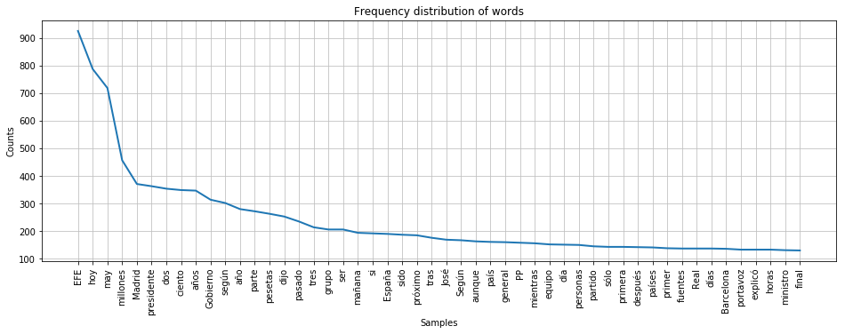
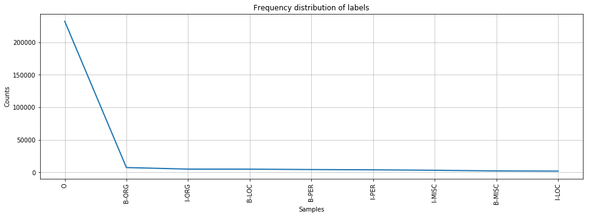
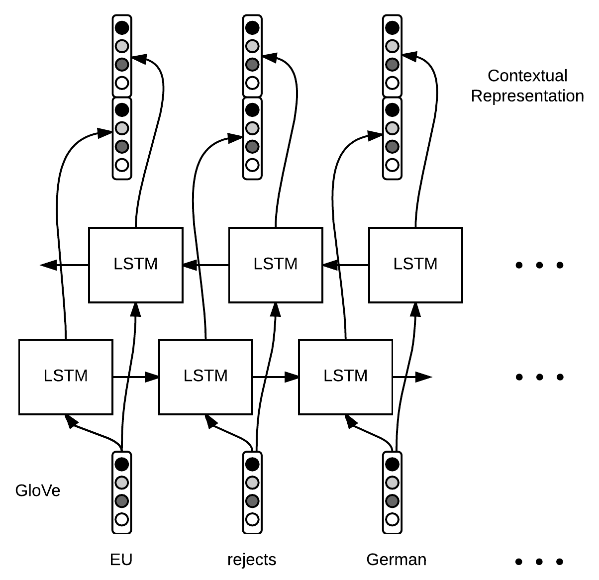
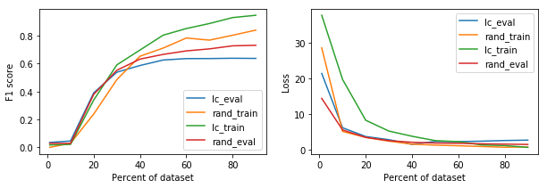
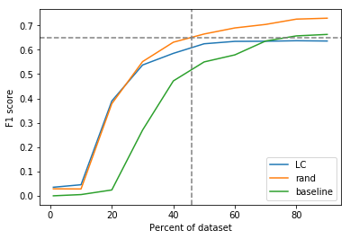
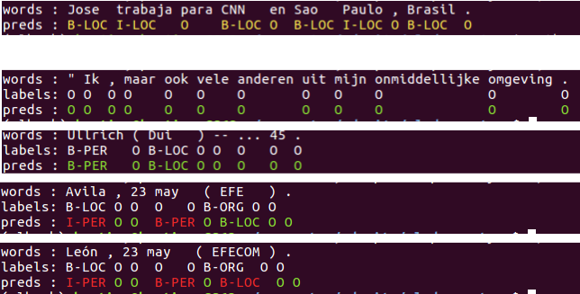

# I. Definition

## Project Overview

Neural Networks can achieve better accuracy for Natural Language Processing tasks compared to traditional rule-based algorithms, or even other types of Machine Learning models [@young2018recent]. Yet, a major problem is that you need a lot of data to train them.

In this project I explore the Active Learning ^[[Wikipedia: Active learning](https://en.wikipedia.org/wiki/Active_learning_(machine_learning))] strategy to train a Recurrent Neural Network for _Sequence Tagging_. In particular, the focus is on the Named Entity Recognition (NER) task. Here, we feed into the algorithm batches of sentences, with the text tokenized, which means that the text will be separated into words. For example the phrase _"Jose trabaja para CNN en Sao Paulo, Brasil."_ will be tokenized and converted to a list:

```
['Jose', 'trabaja', 'para', 'CNN', 'en', 'Sao', 'Paulo', ',', 'Brasil', '.']
 
```

Then the algorithm should predict the labels for each of the tokens, and output a list of same size:

```
['B-PER', 'O', 'O', 'B-ORG', 'O', 'B-LOC', 'I-LOC', 'O', 'B-LOC', 'O']
 
```

The resulting implementation, based on _Bidirectional LSTM ^[[Wikipedia: Long short-term memory](https://en.wikipedia.org/wiki/Long_short-term_memory)] + CRF ^[[Wikipedia: Conditional random field](https://en.wikipedia.org/wiki/Conditional_random_field)]_, plus the application of Active Learning, can make the model achieve state-of-the art performance for the NER task [@shen2017deep], on the popular ConLL2002 Dataset [@conll2002]. The key insight is that the model **only uses 40% of the available training data**, which can potentially reduce the cost of annotation.


## Problem Statement

Neural Networks can achieve better accuracy for NLP tasks compared to traditional rule-based algorithms, or even other types of ML models. Yet, a major problem is that you need a lot of data to train them; as a general rule the more data you have the better. One potential solution to this problem is to make the algorithm learn from a small dataset by changing its internal architecture, or by changing the way it is trained.

To solve the above problem I explore the use of Active Learning for training an RNN model. Active Learning is a semi-supervised learning algorithm, in which the model is given a pool of unlabeled data from where to pick examples, it gives a prediction and ask for feedback to a human annotator. This is also called online learning. On each iteration the algorithm calculates the loss, between its predictions and the feedback, and chooses only the less confident prediction to ask for feedback again. This process is likely to converge faster than choosing at random an annotated example from the pool. And, because the model ask for specific examples, there is no need to annotate all the pool by humans.

The implementation is composed of the following steps:

- Build an RNN model for tagging variable length sentences. The architecture is based on a Bidirectional LSTM module as encoder, and a CRF module as decoder; this algorithm is based on the [@huang2015bidirectional] paper. 
- Build GloVe embeddings to encode words. These are precomputed once, before the training process, so we can reuse this embeddings on different experiments.
- For the Active Learning an automated pipeline is implemented, to simulate the process of interactively annotate the examples by a human.

The utility of the active learning process will be evaluated on multiple experiments. The goal is to achieve at least the same F1 score than with traditional supervised learning (using random sampling), but using only a fraction of the annotated dataset. Results comparable to the ones stated on [@shen2017deep] are expected.


## Metrics

The F1 score (harmonic mean of precision and recall) will be used to measure the accuracy of the trained model. The formula is:

$$F_\beta = (1 + \beta^2) \cdot \frac{\mathrm{precision} \cdot \mathrm{recall}}{(\beta^2 \cdot \mathrm{precision}) + \mathrm{recall}}$$

This is a standard metric for NER, and is used to compare results with [@huang2015bidirectional] and [@shen2017deep] papers.

As the model will be trained many times, on an increasing amount of examples, the F1 score will be reported at each run. This way we can compare the runs and determine at which point the model converges. The scores will be plotted to a learning curve, to better visualise this metrics.

If the train takes to much time to complete the Active Learning becomes not practical, so the time it takes each train run will be measured as well. This will be useful to find the hyper parameters that make the algorithm more efficient.


# II. Analysis

## Data Exploration

Only the CoNLL-2002 Ner dataset [@conll2002] will be used in this project ^[Dataset is available at: https://www.kaggle.com/nltkdata/conll-corpora/version/1#conll2002.zip].

The data contains two languages: Spanish and Dutch, and has three files per language: one for training and two for testing. Each file consists of three columns separated by a single space. Each word has been put on a separate line and there is an empty line after each sentence. The first item on each line is the token, the second is the POS tag, and the third the Named Entity tag. The tags uses de BIO2 syntax: the prefix `B-` denotes the first item of a phrase, and `I-` the continuation of the previous tag. There is also the `O` tag that indicate the token is not part of any named entity. There are four categories for the named entities: person names (PER), organizations (ORG), locations (LOC) and miscellaneous names (MISC). 

I gathered this statistics from the files: 

| file | phrases | words |
| ---- | ------- | ----- |
| dataset/conll2002/esp.testa |  1915 |  52923 |
| dataset/conll2002/esp.testb |  1517 |  51533 |
| dataset/conll2002/esp.train |  8323 | 264715 |
| dataset/conll2002/ned.testa |  2895 |  37761 |
| dataset/conll2002/ned.testb |  5195 |  68994 |
| dataset/conll2002/ned.train | 15806 | 202931 |


And the class distribution is as follows:


| file | O   | B-ORG | I-ORG | B-PER | B-LOC | I-PER | I-MISC | B-MISC | I-LOC |
| ---- | --- | ----- | ----- | ----- | ----- | ----- | ------ | ------ | ----- |
| esp.testa |  45356 |   1700 |   1366 |   1222 |    984 |    859 |    654 |    445 |    337 | 
| esp.testb |  45355 |   1400 |   1104 |   1084 |    735 |    634 |    557 |    339 |    325 | 
| esp.train | 231920 |   7390 |   4992 |   4913 |   4321 |   3903 |   3212 |   2173 |   1891 | 
| ned.testa |  34047 |    748 |    703 |    686 |    479 |    423 |    396 |    215 |     64 | 
| ned.testb |  63236 |   1187 |   1098 |    882 |    807 |    774 |    551 |    410 |     49 | 
| ned.train | 183633 |   4716 |   3338 |   3208 |   2883 |   2082 |   1405 |   1199 |    467 |


## Exploratory Visualization

To better visualize the contents of the dataset a couple of plots were generated. The first one below shows the frequency distribution for the top 50 words in the `dataset/conll2002/esp.train` file. 

{ width=90% }

The second plot, shows the frequency distribution of the labels corresponding to the same file. Here we can see that the majority of words are tagged as "O", which means it is not part of any _Named Entity_. We can also see that there is slightly more samples with "B-ORG" than "I-ORG", this might be because there are more organizations as unigram than n-grams (the name only is one word, rather than multiple words).

{ width=90% }


## Algorithms and Techniques

As stated before, the model architecture consist of a Bidirectional LSTM module as the _encoder_, and a CRF module as _decoder_. This architecture is based on the [@huang2015bidirectional] paper, and has the following stages that will be explained in detail:

- Word Representation
- Contextual Word Representation
- Decoding


### Word Representation

For each word, we want to build a vector $w \in \mathbb{R}^n$ that will capture the meaning and relevant features for the NER task. We’re gonna build this vector by extracting the word embeddings $w_{glove} \in \mathbb{R}^{d}$ from GloVe. We will use pre-trained GloVe vectors ^[[GloVe: Global Vectors for Word Representation](https://nlp.stanford.edu/projects/glove/)] on _Common Crawl_, which is a dataset with around 840 Billion words, in many languages, all scrapped from the web.


### Contextual Word Representation

Once we have our word representation $w$ we simply run a LSTM (or bi-LSTM) over the sequence of word vectors and obtain another sequence of vectors (the hidden states of the LSTM or the concatenation of the two hidden states in the case of a bi-LSTM), $h \in \mathbb{R}^k$.

{ width=60% }

### Decoding

At this stage, each word $w$ is associated to a vector $h$ that captures information from the meaning of the word, and its context. We can use a fully connected neural network to get a vector where each entry corresponds to a score for each tag. With this, we want to be able to compute the probability $\mathbb{P}(y_1, \ldots, y_m)$ of a tagging sequence $y_t$ and find the sequence with the highest probability. Here, $y_t$ is the id of the tag for the t-th word.

Using _dynamic programing_ we can compute efficiently an optimal sequence. The [@huang2015bidirectional] paper describes thoroughly an implementation for this.


### Active Learning

The active learning method is based on _Uncertainty Based Sampling_, more specifically "Least Confidence" which is described in [@shen2017deep]. The paper proposed to sort examples in ascending order according to the probability assigned by the model to the most likely sequence of tags.

$$1 - \operatorname{argmax}_{y_1, \ldots, y_n} \mathbb{P}[y_1, \ldots, y_n | \{x_{ij}\}]$$

Here, an automated pipeline is implemented, to simulate the process of interactively annotate the examples by a human. The heuristic could be as follow:
 
- First, the model is initialized randomly with 1% of the train dataset from Conll2002, $\mathbb{X}_0 \in \mathbb{Z}$. 
- Before each train run $t$ the model will make predictions $\mathbb{Y}_{t-1}$ on the full unlabeled pool (here the model is using the state from the previous train). 
- Based on this predictions it will choose the next batch of samples to annotate, $\mathbb{S}_t \in \mathbb{Z}^U$.
- Then, it looks the labels for this samples on the original dataset $\mathbb{S}_t \in \mathbb{Z}^L$ (this is the simulation of a human annotating the examples).
- Finally, it adds this labeled samples to his current train dataset $\mathbb{X}_{t} = \mathbb{X}_{t-1} + \mathbb{S}_t$. And the model is trained again on the updated dataset $\mathbb{X}_{t}$.


## Benchmark

The algorithm to be implemented will not be design to get state of the art performance on this corpus (F1 score +90.0). But, as the architecture chosen is based on the bi-LSTM-CRF algorithm from [@huang2015bidirectional], the results in terms of accuracy should be similar of those reported in that paper (F1 score 84.26).

The benchmark will be focus on the use of Active Learning during training. With the same amount of training data, the model should get at least the same accuracy than trained with random sampling. 


# III. Methodology

## Data Preprocessing

In this case, the only preprocessing of the dataset is to reformat the files to make it easy to read the sentences and labels. Instead of having a token per line, we save one sentence per line in a new file `train.words.txt`, and separate the tokens by a space; in another file `train.tags.txt` we save the labels, the same way as before. This has the advantage that we can lookup a sentence, and its correspondent labels, by its line index on the file.

With those files we generate a vocabulary `vocab.words.txt`. Then we precompute the word embeddings with pre-trained GloVe vectors from `glove.840B.300d.txt` ^[Availablle at: http://nlp.stanford.edu/data/glove.840B.300d.zip]. For each word in the vocabulary we extract the vector from that file, saving them in the file `glove.npz`, which is a numpy array of shape (_vocab_length_ x _embedding_dimensions_).


## Implementation

In the beginning I tried to implement the algorithm using the _Tensorflow_ low level APIs, and soon I realized that you need a lot of boilerplate to make it work. In particular, to train an RNN on variable length text, you have to create your own logic to batch sentences, taking into account you have to pad the shorter ones. Also, configure the model checkpoints and metrics gathering was a real challenge.

Luckily, I found great tutorials ^[[Introduction to Estimators - Tensorflow docs](https://www.tensorflow.org/guide/estimators)] ^[[Intro to tf.estimator and tf.data, by Guillaume Genthial](https://guillaumegenthial.github.io/introduction-tensorflow-estimator.html)] about the `tf.estimator` and `tf.data` APIs. Those APIs simplify significantly the implementation, as they abstract the training, evaluation, and metrics serialization (for _Tensorboard_ ^[This is a tool for visualize graphs and data from Tensorflow.]) processes.


### bi-LSTM + CRF with TensorFlow Estimators

First, for the ingestion pipeline I used `tf.data.Dataset.from_generator`, which allows you to do the data loading (from file or elsewhere) and some preprocessing in python before feeding it into the graph. As a convenience, we can define the function `input_fn` and pass it to the _Estimator_ later on; this function creates the dataset from the generator (which reads the files `train.words.txt` and `train.tags.txt` as explained in previous section), and can be parameterized depending on your needs.

Second, the `model_fn` function is were you define the computation graph. With both functions we can create our model, or estimator, and pass it to the `tf.estimator.train_and_evaluate` method, which runs the training, evaluation, etc.

Here I want to explain a little bit about the architecture:

```python
    
    # Word Embeddings
    word_ids = vocab_words.lookup(words)
    glove = np.load(params['glove'])['embeddings']  # np.array
    variable = np.vstack([glove, [[0.] * params['dim']]])
    variable = tf.Variable(variable, dtype=tf.float32, trainable=False)
    embeddings = tf.nn.embedding_lookup(variable, word_ids)
    embeddings = tf.layers.dropout(embeddings, rate=dropout, training=training)
    
    
```

The first step in the graph is getting the word representation. Using a vocabulary lookup table we can map token strings to ids. Then, we load a `np.array` containing the pre-trained _GloVe_ vectors (as explained in previous section), where the row index corresponds to a token id. Here we set the `trainable` parameter to false because we do not want to change the embeddings. Next, the model will perform a lookup in this array to get the embedding of every token. And finally, we apply dropout to the dense representation to prevent overfitting.
 

```python
    
    # LSTM
    t = tf.transpose(embeddings, perm=[1, 0, 2])
    lstm_cell_fw = tf.contrib.rnn.LSTMBlockFusedCell(params['lstm_size'])
    lstm_cell_bw = tf.contrib.rnn.LSTMBlockFusedCell(params['lstm_size'])
    lstm_cell_bw = tf.contrib.rnn.TimeReversedFusedRNN(lstm_cell_bw)
    output_fw, _ = lstm_cell_fw(t, dtype=tf.float32, sequence_length=nwords)
    output_bw, _ = lstm_cell_bw(t, dtype=tf.float32, sequence_length=nwords)
    output = tf.concat([output_fw, output_bw], axis=-1)
    output = tf.transpose(output, perm=[1, 0, 2])
    output = tf.layers.dropout(output, rate=dropout, training=training)
    
    
```

The second step is getting the context representation by applying a _bidirectional LSTM_ on top of the token representation. This is composed of two layers, one that reads the sequence forward in time, and the other that reads it backwards. The oputput of both layers are concatenated together, to produce a vector of shape (_time_len_ x _batch_size_ x _input_size_). This is useful as we can get more context by reading the sentences in both directions; as stated in [@huang2015bidirectional] "_we can efficiently make use of past features (via forward states) and future features (via backward states) for a specific time frame_".

We use `tf.contrib.rnn.LSTMBlockFusedCell` cells because this implementation is very efficient on GPUs ^[As stated in the docs: https://www.tensorflow.org/api_docs/python/tf/contrib/rnn/LSTMBlockFusedCell], and this is critical for the active learning process. At the end, we add a dropout layer that we activate only when training the model.
 

```python
    
    # CRF
    logits = tf.layers.dense(output, num_tags)
    crf_params = tf.get_variable("crf", [num_tags, num_tags], dtype=tf.float32)
    pred_ids, best_score = tf.contrib.crf.crf_decode(logits, crf_params, nwords)
    
    
```

The third step is decoding the sentence using a CRF. As explained in previous sections, we use a fully connected layer to get a vector where each entry corresponds to a score for each tag. Then, trough dynamic programing we can calculate the sequence of tags with the higher score. This is already implemented in Tensorflow, so we only add one line here. 


```python

    # Loss
    vocab_tags = tf.contrib.lookup.index_table_from_file(params['tags'])
    tags = vocab_tags.lookup(labels)
    log_likelihood, _ = tf.contrib.crf.crf_log_likelihood(logits, tags, nwords, crf_params)
    loss = tf.reduce_mean(-log_likelihood)
    if mode == tf.estimator.ModeKeys.TRAIN:
        train_op = tf.train.AdamOptimizer().minimize(loss)
    
    
```

We calculate the loss by computing the log likelihood of tag sequences, using the transition params from the CRF. Then, we use AdamOptimizer to minimize the loss. 


### Active learning

Last but not least, the Active Learning process has its own challenges. The main issue is that this process requires _incremental update of the weights_, this is because each time we train the model with a small sample from the pool, then immediately after we need to run predictions over the complete pool of data. Luckily, the `tf.estimator.Estimator` class has the `warm_start_from` property that allow you to use the weights from a previous checkpoint.

The other difficulty lies with the Active Learning heuristic explained before, as we need to "simulate the process of interactively annotate the examples by a human". To implement this _simulation_ we run the training in a loop, before each retrain we load the last saved checkpoint to make the predictions over the `train.words.txt` file, then we save all the scores on a new file `pool.scores.txt` making sure to preserve the order. From this file we choose the indices of the next samples to annotate, and peek the corresponding labels from the `train.tags.txt` file.  Finally, we run the train on the updated dataset, and the process repeats.


## Refinement

In early trials the model generated the embeddings as part of the training process. Then I realized this was taking too much time, and it would hardly converge on such a small dataset. I decided to use pre-trained embeddings instead, so the model do not have to compute them at every train step.

Another refinement was basically tuning the hyperparameters. The first run only uses 1% of the training data so the _batch size_ has to be less than that (80 samples), but the subsequent runs used a higher _batch size_ (160 samples)  as it has more data available. Also, the _epochs_ had to be small (5 epochs) for the training to be as fast as possible; in the active learning setting it is preferred to ask for feedback quickly, rather that spent a lot of time training on the whole dataset.
 

# IV. Results

## Model Evaluation and Validation

To evaluate the model performance the following metrics were calculated after each training run: F1 score (and its components like Accuracy, Precision, Recall), the Loss, and the relative Step time. The validation file `ned.testa` was used to compute those scores; it was used only to tune the hyperparameters, and not as part of the training dataset.

{ width=85% }

In the Figure 4 above, we can see the metrics calculated for the _dutch_ language dataset. On the left graph we see the F1 score (range $(0, 1) \in \mathbb{R}$) related to the percentage of the dataset used for training (between 1% and 90%). On the right, we see computed loss. In both cases the lines plotted represent the combination of the sampling method used, and the dataset on which the metrics were calculated on (trainig and validation datastest).

Next, in the Figure 5 we see three lines: the **baseline** (green) is the performance that the model achieves on a purely supervised learning setting (i.e. a single training with the full dataset, for 25 epochs). The other two lines correspond to the performance of the _Active Learning_ process, using two different sampling methods: **Least confidence** (blue) and **Random** (orange). The main difference between these methods is that the later does not use the predictions scores to choose examples from the pool (i.e it could be more efficient at the beginning because it does less computations).

In Figure 5 the dotted lines mark the point in which the accuracy of the model (~46% of dataset) is roughly the same as the baseline (F1 ~0.66).

{ width=55% }

In the below table the mean time for each training run is reported (these are calculated while using an NVIDIA GTX 1060 GPU). We can see that the baseline (i.e. the supervised learning approach) is the slowest, and the _random sampling_ is the fastest. This is coherent because the baseline runs the training on more epochs; also the _rand_ sampling does not need to run predictions to choose samples, while the _lc_ does.

| dataset | sampling | mean time (secs) |
| ------- | -------- | ---------------- |
| ned | lc | 43.2 |
| ned | rand | 24.3 |
| ned | baseline | 829.8 |


## Justification

First, we can see in Figure 5 that the active learning achieves the same score as the _baseline_, but using **only half of the labeled dataset**. These results are aligned with the initial goals of the project, which was _training the model with a smaller dataset_  while maintaining the accuracy; this could potentially reduce the cost of annotation.

In the next table, we compare the performance of this model with the ones defined in the benchmark. While there cant be a direct comparison, because they used a slightly different dataset, the score achieved for our model is still very competitive; and with some tweaks this could be further improved.

| algorithm | dataset | sampling | best F1 score |
| --------- | ------- | -------- | ------------- |
| bi-LSTM + CRF (this) | Conll2002 | lc | 66.21 |
| bi-LSTM + CRF (this) | Conll2002 | rand | 75.34 |
| bi-LSTM + CRF [@huang2015bidirectional] | CoNLL2003 | - | 84.26 |
| CNN + CNN + CRF [@shen2017deep] | CoNLL2003 | - | 90.35 |


# V. Conclusion

## Free-Form Visualization

The Figure 6 depicts some testing I did on the resulting models, for both languages. This is generated with the `predict.py` file, which reads a folder of the exported model (generated by `export.py`). In the example at the top of the image, the model gives predictions over an unseen text; the predictions are in yellow because there were not true labels to compare with. The rest of the examples were taken at random from the `testb` dataset, in this case the model compared its predictions with the real labels and marked the token green if the they match, or red otherwise.

{ width=80% }


## Reflection

Using _Deep Learning_ for _Natural Language Processing_ tasks is a growing trend in recent years. Given its incredible success on other areas like _Computer Vision_ it is reasonable to think that it could be a good fit for NLP, but  the fundamental difference between these domains is that images are a dense representations, and text is sparse. This leads to the use of Recurrent Neural Networks which fits perfectly this domain, but the main issue of DL remains: you need a whole bunch of information to train this algorithms.

Fortunately on the internet there is an infinite amount of text you can feed into an RNN, but only a small percent is annotated. And this is a must, because in general RNN use supervised learning. Here lies the need to find an alternative, and in this project I explored Active Learning.

The results of this project reflects that this approach has the potential to solve the main issue of DL, or at least alleviate it. And this is my main motivation, find a way to reduce the cost of annotating text corpora, and be able to show the usefulness of DL.

In this project I've implemented an automatic pipeline for the AL process, but the idea is to take this approach in a real setting. For example, for annotation projects with a tight budget, the annotator could interactively train the algorithm by giving feedback on its predictions.

Lastly, I had to say that given the time constraints I could not get the best performance out of the model, but I'll explain in the next section some potential improvements for the implementation.


## Improvement

One way to improve this algorithm is the use of _character level representation_ as suggested in [@shen2017deep]. With these the model could potentially learn sequences for variants of the words in the dataset, by deriving the new tokens from the stem word, or it can be more sensitive to capitalization.

On the other hand, we could improve the Active Learning by using as sampling method the _Maximum Normalized Log Probability_, also suggested in [@shen2017deep]. The problem with the _Least Confidence_ sampling is that it disproportionally chooses longer sentences, as it assumes those are harder to annotate. These could potentially achieve higher accuracy than using _rand_ sampling.


# References
